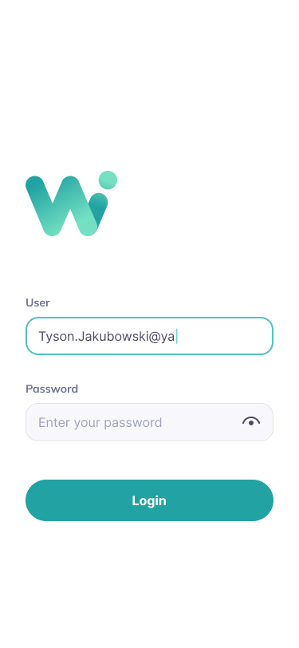
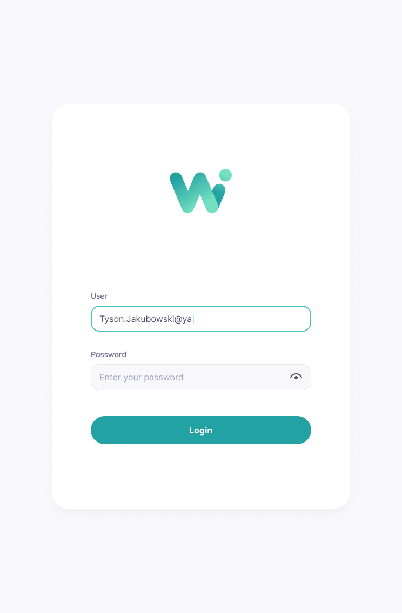
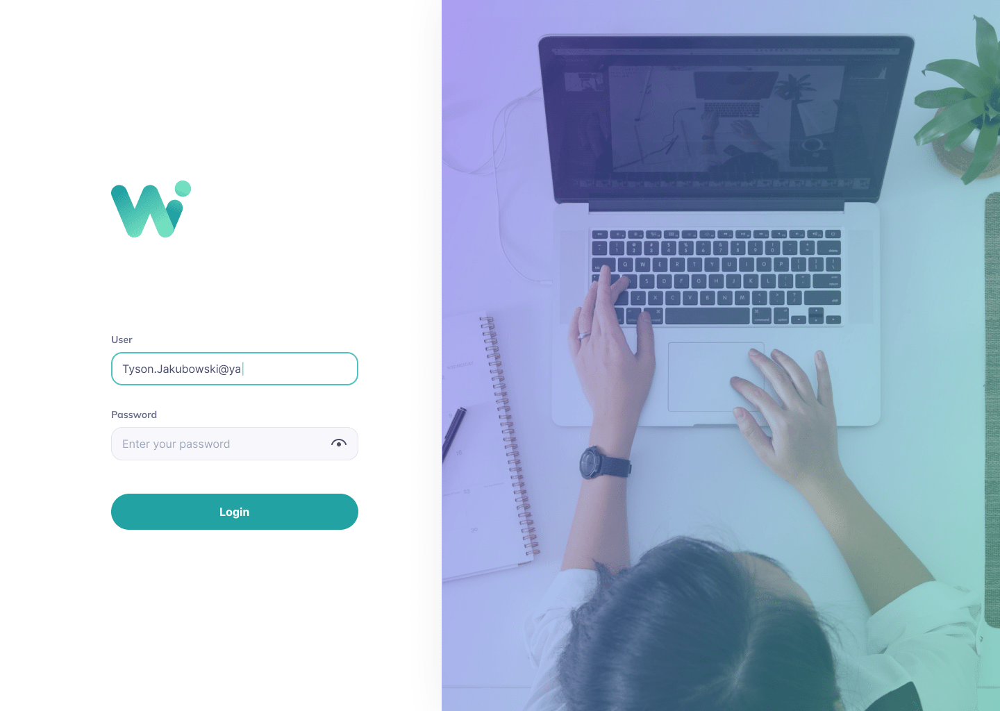

## Welcome! 👋

Thanks for checking out this front-end coding challenge.

This is a technical challenge I realized for an interview with the company Widitrade.

The Figma design file can be found under: [https://www.figma.com/file/5BghJ9wQC72j4M5nsOWSr0/Conversion?node-id=0%3A1]

## The challenge

The challenge was to build out this responsive Login page (mobile + tablet + desktop) from the design provided in the Figma file.

The user / website should be able to:

- View the optimal layout depending on the device's screen size
- Insert the username and the password in the corresponding fields
- Toggle whether or not the password is visible
- Click on the Login button to verify if the fields are not empty
- Be redirected to a new page if the Login is valid, after Login form is submitted.

For this challenge I chose to use React and Next.js to practice on React components, state management and form validation and discover the Next.js framework which I have never used before.

## Preview Snapshots

### Mobile Layout: 375x812px



### Mobile Layout: 744x1133px



### Mobile Layout: 1440x1024px



This is a [Next.js](https://nextjs.org/) project bootstrapped with [`create-next-app`](https://github.com/vercel/next.js/tree/canary/packages/create-next-app).

## Getting Started

First, run the development server:

```bash
npm run dev
# or
yarn dev
```

Open [http://localhost:3000](http://localhost:3000) with your browser to see the result.

You can start editing the page by modifying `pages/index.js`. The page auto-updates as you edit the file.

[API routes](https://nextjs.org/docs/api-routes/introduction) can be accessed on [http://localhost:3000/api/hello](http://localhost:3000/api/hello). This endpoint can be edited in `pages/api/hello.js`.

The `pages/api` directory is mapped to `/api/*`. Files in this directory are treated as [API routes](https://nextjs.org/docs/api-routes/introduction) instead of React pages.

## Learn More

To learn more about Next.js, take a look at the following resources:

- [Next.js Documentation](https://nextjs.org/docs) - learn about Next.js features and API.
- [Learn Next.js](https://nextjs.org/learn) - an interactive Next.js tutorial.

You can check out [the Next.js GitHub repository](https://github.com/vercel/next.js/) - your feedback and contributions are welcome!

## Deploy on Vercel

The easiest way to deploy your Next.js app is to use the [Vercel Platform](https://vercel.com/new?utm_medium=default-template&filter=next.js&utm_source=create-next-app&utm_campaign=create-next-app-readme) from the creators of Next.js.

Check out our [Next.js deployment documentation](https://nextjs.org/docs/deployment) for more details.
